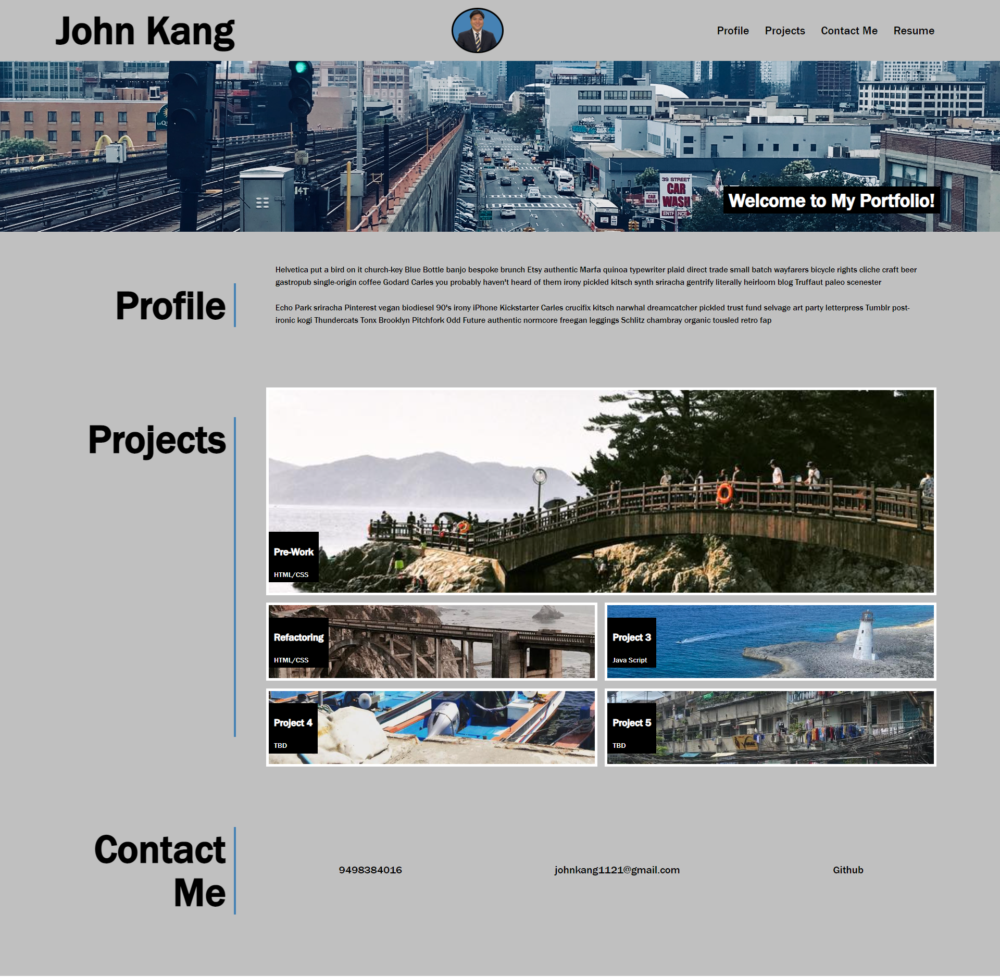

# John Kang Challenge-2 Creating a portfolio 
The purpose of this assigment was to create a portfolio to easliy showcase the differnt projects I worked on for potential employers. The website was bulit from scrath using both HTML and CSS. The given example was used as a baseline for how the website was formatted. The porfolio I created contains a profile, projects, and contact section with links that will take the user to the desired information.  

## Screenshot of deployed website 
 

### Deployed Site 
https://jyk33.github.io/Creating-a-portfolio/
